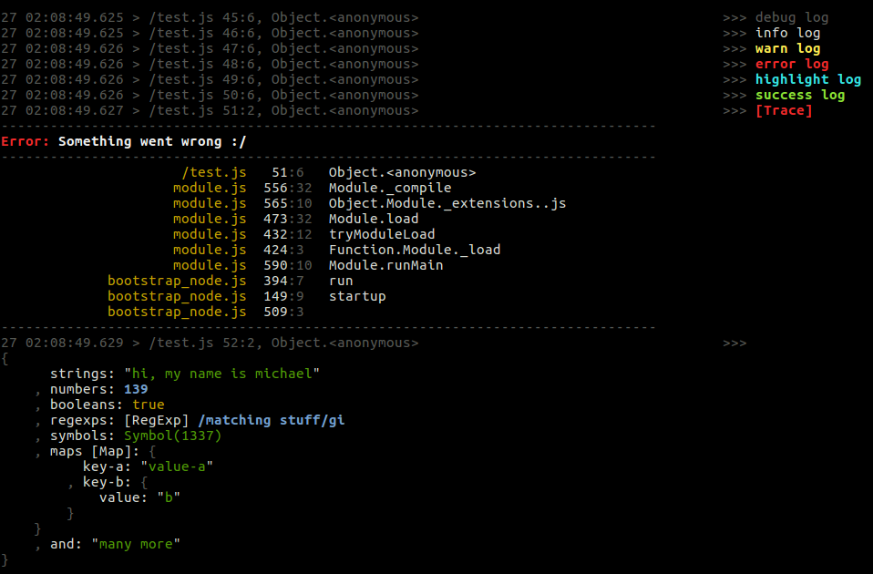

# ee-log

Easy, simple & useful logging


[](https://www.npmjs.com/package/ee-log)
[](https://travis-ci.org/eventEmitter/ee-log)
[](https://nodejs.org/)
[](https://www.bithound.io/github/eventEmitter/ee-log)





# API

The module exposes a set of methods that can be used to print colorful logs. Each of the methods accepts an unlimited amount of parameters. All of the parameters will be printed. Objects will automatically printed in an expanded form, errors will be printed in a more readable form. Each log log statement is prefixed with the exact file and line where the log statement is located.

## Methods

- debug: grey text
- info: white text
- warn: yellow text
- error: red text
- success: green text
- highlight: violet text

	

```
log.error('not good!');
```

you may also use the module itself to log items

```
const log = require('ee-log');

log('this is awesome', {
	someValue: true
}, new Error('fancy error printing'));
```
